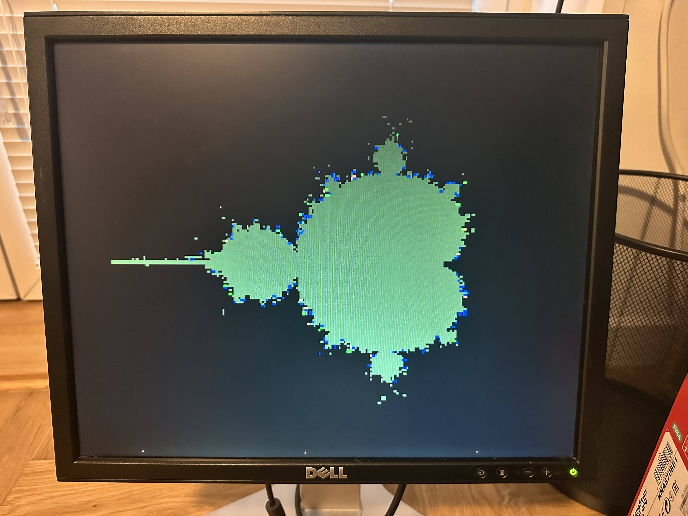

# mega-iso-vga

Use old Trident TVGA9000I-1 (7210 REVH1) ISA VGA card with Arduino Mega.

<table>
    <tr>
        <td>
            
        </td>
        <td>
            
        </td>
        <td>
            
        </td>
    </tr>
    <tr>
      <td></td>
      <td></td>
      <td></td>
    </tr>
</table>

Supported modes:

* Mode03H - Text mode, 80 x 25, 16 colors, blinking
* Mode13H - Video mode, 320 x 200, 256 colors
* Mode 12H - Video mode, 640 x 480, 16 colors

There are still some bugs related to VGA planes. But overall the demo is working.

## Based on work

This project is based on this great hack: [www.tinyvga.com/avr-isa-vga](http://www.tinyvga.com/avr-isa-vga).
I borrowed greatly from this code, but it was not working for me out of the box.

Other useful links & resources:

* ISA Bus overview - http://wearcam.org/ece385/lecture6/isa.htm
* Wiki ISA Bus entry - https://en.wikipedia.org/wiki/Industry_Standard_Architecture
* How Video BIOS are find & loaded - https://en.wikipedia.org/w/index.php?title=BIOS&oldid=1122365436#Extensions_(option_ROMs)
* Trident BIOS files - https://github.com/skiselev/isa-super-vga/tree/main/firmware (I cannot decompile them with Ghidra, TODO)
* VGA source code files in QEmu - https://github.com/qemu/qemu-palcode/blob/master/vgatables.h

Of great help where VGA entries in OSDev wiki:
* https://wiki.osdev.org/VGA_Hardware#VGA_Registers
* https://wiki.osdev.org/VGA_Hardware#Memory_Layout_in_16-color_graphics_modes
* https://wiki.osdev.org/Text_Mode_Cursor#Font_based_%22graphical%22_cursor
* https://wiki.osdev.org/Text_UI
* https://wiki.osdev.org/VGA_Fonts

I managed to fix font loading using this forum thread: https://forum.osdev.org/viewtopic.php?f=1&t=25375
(I did not use padding, hence I only loaded every other font glyph).

## Trident TVGA9000I setup

* Initially I tried to use 16 bit ISA mode but it was not working. So had to switch to 8-bit ISA mode.
 I had to switch two jumpers, one to use 8-bit ISA mode and second to use legacy 8-bit BIOS mode (disable BIOS autodetection).
 All jumpers are described here: https://www.minuszerodegrees.net/manuals/Trident/Trident%20-%20TVGA%209000i%20Graphics%20Adapter%20-%20User's%20Manual%20-%20Rev.%20B.pdf

* Since I use 8bit ISA mode I disconnected all the "16bit ISA pins" except power.

* Card was not working without OSC signal. I did not had the 14.3... MHz crystal so I initially used 10MHz but the frequency was too low (it is used to refresh dynamic RAM) so
all my writes to memory were vanishing. Then I switched to 16MHz crystal the card started to work but it was getting really hot. Now I wait for 14.3 MHz crystal delivery...

* Looks like RESET signal did not reset all internal registers. In other words if you mess something with them just resetting the card may not be enough.
What I found to be useful is to leave the card without power for at least 30 mins or even over night. Then all the registers will go back to their default values.
Yes this is very strange, maybe it is just in my head?

